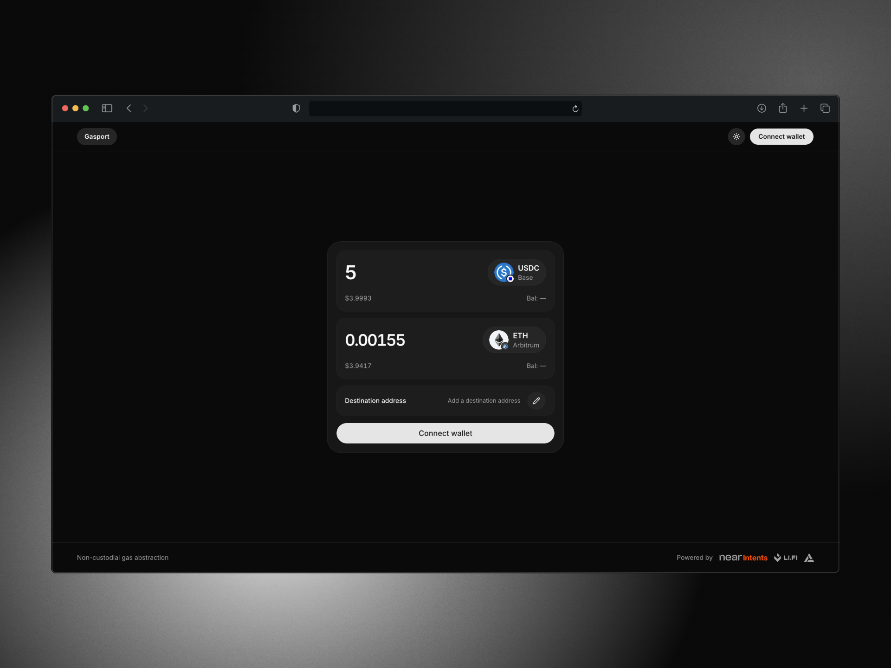
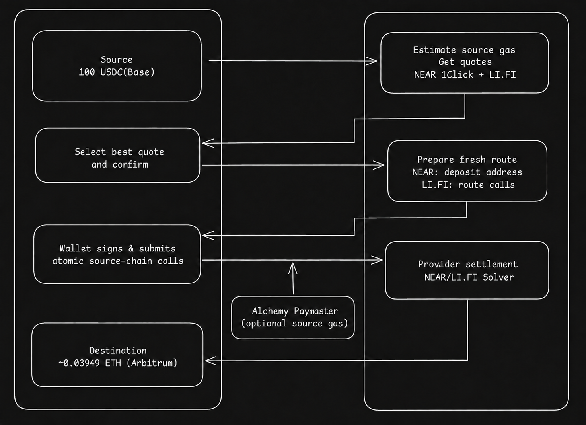

# Gasport

Gasport swaps an ERC-20 token for native gas across EVM chains using NEAR intents, LI.FI intents and Alchemy paymaster.



## Getting started

You need Node.js 20.9 or newer and pnpm 10.

```bash
git clone https://github.com/saurabhburade/gasport.git
cd gasport
pnpm install
cp .env.example .env.local
pnpm dev
```

Open [http://localhost:3000](http://localhost:3000).

Demo mode is enabled in `.env.example`. Add a Reown project ID to test wallet connections. Set `NEXT_PUBLIC_ENABLE_DEMO_MODE=false` only when the server-side provider and sponsorship variables are ready.

Local sponsored calls need HTTPS. Start the tunnel in another terminal and copy its URL into `NEXT_PUBLIC_PAYMASTER_PROXY_URL`:

```bash
pnpm dev:tunnel
```

If Next.js is running with `next dev --experimental-https`, use `pnpm dev:tunnel:https` instead. Set `NEXT_PUBLIC_PAYMASTER_PROXY_URL` to the tunnel's public HTTPS URL plus `/api/gas/sponsored`, then restart Next.js. `https://localhost:3000` alone is not a valid wallet paymaster URL because the wallet service cannot reach your machine's localhost.

## Environment variables

Copy `.env.example` to `.env.local`. Keep server variables out of client code and never add a `NEXT_PUBLIC_` prefix to API keys.

### Browser

| Variable | Use |
| --- | --- |
| `NEXT_PUBLIC_APP_URL` | Public app URL used in wallet metadata. |
| `NEXT_PUBLIC_REOWN_PROJECT_ID` | Enables the Reown AppKit wallet modal. |
| `NEXT_PUBLIC_ENABLE_DEMO_MODE` | Set to `false` to allow live submission. Defaults to demo mode. |
| `NEXT_PUBLIC_PAYMASTER_PROXY_URL` | HTTPS proxy for sponsored calls during local development. |

### Server

| Variable | Use |
| --- | --- |
| `NEAR_INTENTS_API_KEY` | Authenticated 1Click quotes, deposits, and transaction history. |
| `NEAR_INTENTS_API_URL` | Optional 1Click API override. |
| `NEAR_INTENTS_EXPLORER_API_URL` | Optional explorer API override. |
| `NEAR_INTENTS_MANAGER_PUBLIC_KEY` | Optional override for quote-signature verification. |
| `NEAR_INTENTS_REFERRER_ID` | Optional 1Click referral ID. |
| `NEAR_INTENTS_FEE_BPS` | App fee in basis points, from `0` to `500`. |
| `NEAR_INTENTS_FEE_RECIPIENT` | Recipient required when the 1Click app fee is enabled. |
| `LIFI_API_KEY` | Optional LI.FI API key for higher rate limits. Validate it with LI.FI's `/v1/keys/test`; invalid keys fall back to the public rate limit. |
| `PLATFORM_FEE_RECIPIENT` | Recipient for the LI.FI platform fee. |
| `SPONSORED_GAS_FEE_RECIPIENT` | Recipient for recovered source-gas costs. |
| `ALCHEMY_API_KEY` | Alchemy Gas Manager API key. |
| `ALCHEMY_POLICY_ID` | Shared Alchemy policy fallback. |
| `ALCHEMY_POLICY_ID_<CHAIN>` | Chain-specific policy. Supported suffixes are `ETHEREUM`, `BASE`, `ARBITRUM`, `OPTIMISM`, and `MONAD`. |

## Architecture

- `src/app/` contains the Next.js App Router pages and API routes.
- `src/components/` contains the workspace, wallet controls, and UI primitives. Each component has its own implementation file.
- `src/hooks/` owns browser-side quote and execution state.
- `src/lib/routes/` defines the common route interface. The `near-oneclick` and `lifi` adapters normalize quotes, prepared calls, fees, and settlement status.
- `src/lib/gas/` estimates source gas, chooses the execution strategy, and builds wallet calls.
- `src/lib/intents/` handles 1Click requests, schemas, authentication, and quote-signature checks.
- `src/config/` contains chain, token, wallet, and fee configuration.
- `src/types/` contains shared application types.

API routes validate external data with Zod before returning it to the browser. Token amounts stay as integers or decimal strings until display. Wallets sign and submit transactions; the app does not handle private keys.



Sponsorship and platform fees are deducted from the entered amount. They are not added on top. A failed atomic wallet batch does not leave a partial route execution.

## Commands

| Command | Use |
| --- | --- |
| `pnpm dev` | Start the development server. |
| `pnpm dev:tunnel` | Start the local ngrok tunnel. |
| `pnpm dev:tunnel:https` | Tunnel to a local HTTPS development server. |
| `pnpm test` | Run the Node test suite. |
| `pnpm lint` | Run Biome checks. |
| `pnpm format` | Format supported files with Biome. |
| `pnpm build` | Create a production build. |
| `pnpm scan:secrets` | Scan tracked files and Git history for high-signal credentials. |

Provider references: [NEAR Intents 1Click](https://docs.near-intents.org/integration/distribution-channels/1click-api/sdk) and [LI.FI](https://docs.li.fi/).
